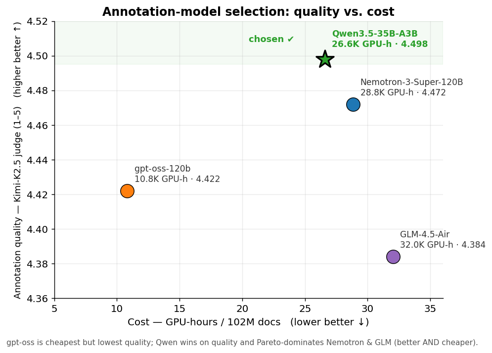
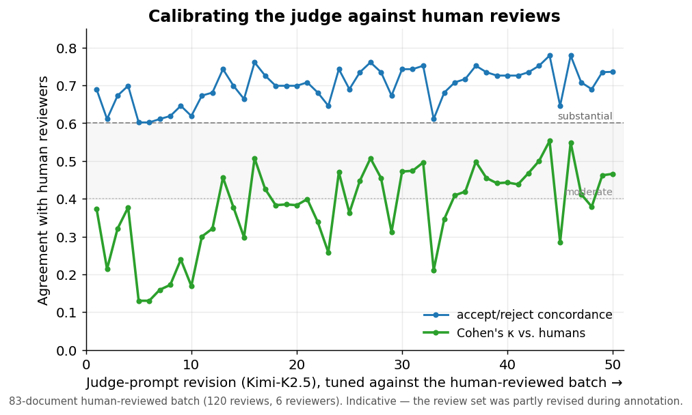
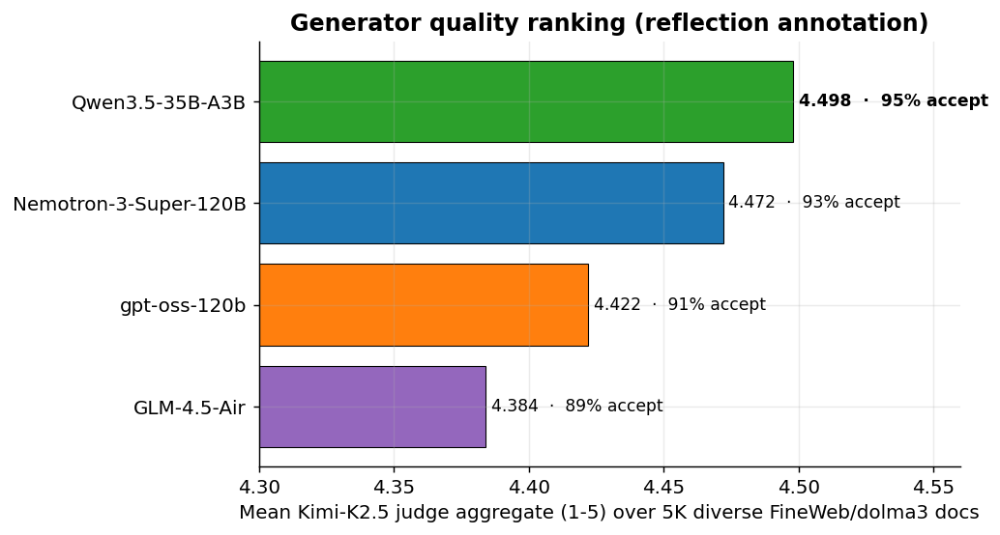
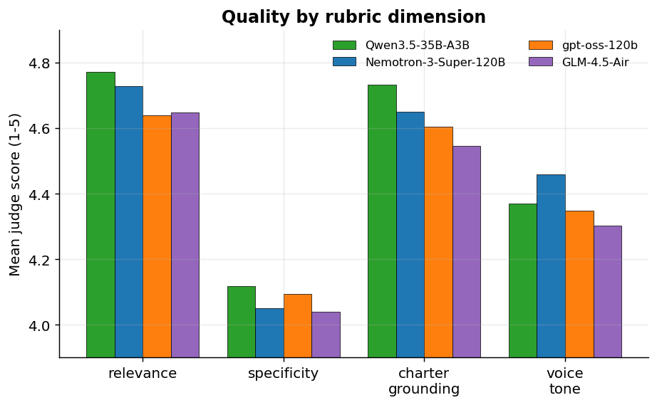
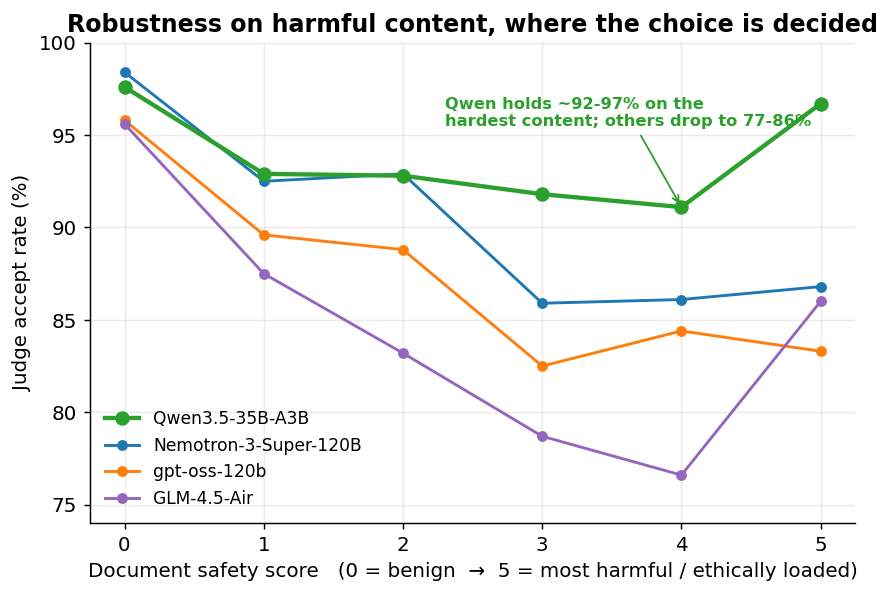

# Choosing the annotation model

How we picked the model that annotates the pretraining corpus (charter
reflections over ~102M FineWeb/dolma3 documents).

**Decision: `Qwen3.5-35B-A3B-FP8`.** Of the candidates we could afford to run at
scale, it produced the best charter annotations, held up best on harmful and
ethically loaded content, and came in cheaper than the models that scored
anywhere near it.



| Model | Judge aggregate ↑ | Accept rate ↑ | GPU-h / 102M ↓ | Active / total params | Verdict |
|---|:--:|:--:|:--:|:--:|---|
| **Qwen3.5-35B-A3B-FP8** | **4.498** | **95.4%** | 26.6K | 3B / 35B | chosen |
| Nemotron-3-Super-120B-A12B-FP8 | 4.472 | 93.4% | 28.8K | 12B / 120B | lower quality, costs more |
| gpt-oss-120b | 4.422 | 90.6% | 10.8K | 5B / 120B | cheapest, lowest quality |
| GLM-4.5-Air-FP8 | 4.384 | 88.8% | 32.0K | 12B / 106B | lowest quality, costs most |

Quality numbers come from `charter.eval` (`ref_v3` plus `ref_v4_qwen`), scored by
the Kimi-K2.5 gold judge on a 5K diverse pool. Cost comes from the throughput
benchmarks (reflection prompt, tuned SGLang). Sources are listed at the bottom.

---

## The process

Annotating 102M documents is expensive, and annotation quality does not track
raw model size, so this was not a single bake-off. We screened on cost, built a
judge we could trust by calibrating it against human reviews, tuned each
candidate's prompt separately against that judge, and only then compared the
models on a large pool.

```
~10 candidate models
    |
    |  Stage 1  cost screen: benchmark on GH200, extrapolate GPU-h for 102M
    v
4 affordable candidates: gpt-oss-120b, GLM-4.5-Air, Qwen3.5-35B-A3B, Nemotron-3-Super
    |
    |  Stage 2  judge calibration: humans review a seed batch, tune the judge to agree
    |  Stage 3  per-model prompts: improver loop tunes each model's prompt separately
    |  Stage 4  cross-model bake-off: each model's own prompt on a 5K pool, scored by the judge
    v
Qwen3.5-35B-A3B-FP8  (chosen)
```

## Stage 1: cost and throughput screen

Each candidate ran under SGLang on a single GH200 node (4 GPUs), driven at
saturation, with its samples/sec extrapolated to the full 102M-document corpus.
The screen dropped any model whose scale cost was prohibitive regardless of
quality:

| Model | GPU-h for 102M | Status |
|---|--:|---|
| gpt-oss-120b | ~10.8K | to bake-off |
| **Qwen3.5-35B-A3B-FP8** | ~26.6K | to bake-off |
| Nemotron-3-Super-120B-A12B-FP8 | ~28.8K | to bake-off |
| GLM-4.5-Air-FP8 | ~32.0K | to bake-off |
| Qwen3.5-122B-A10B-FP8 | ~88.9K | screened out (cost) |
| GLM-4.5-Air (bf16) | ~217K | screened out (cost) |
| Qwen3.5-397B-A17B | ~827K | screened out (cost) |
| Kimi-K2.5 | ~1.7M | screened out, used as the judge |

Two findings from this stage drove most of the savings and carry over to the
production runs:

- FP8 with data parallelism, not tensor parallelism. For a model that fits on
  one GPU, `TP1×DP4` runs about 2.4x cheaper than `TP4×DP1`. Don't shard what
  fits.
- Hybrid (Mamba/DeltaNet) models need tuning. `--mamba-ssm-dtype bfloat16` with
  `--mem-fraction-static 0.88` and a rebalanced Mamba/KV pool cut Qwen3.5-35B by
  18% and Nemotron-3-Super by 43% against defaults. The remaining bottleneck is
  memory-bandwidth-bound MoE decode (256 fine-grained experts), confirmed by a
  16-config flag sweep and a Triton MoE kernel retune. No further config helped.

The larger Qwen3.5-122B and 397B and Kimi were never going to be
cost-competitive for a full-corpus pass. Kimi-K2.5 stays in the picture as the
judge rather than the annotator.

## Stage 2: judge calibration against human reviews

Everything downstream is scored by an LLM judge, so the judge has to be
trustworthy before it ranks anything, and we checked that against humans rather
than assuming it.

Annotators first hand-reviewed a seed batch: 120 reviews over 83 documents by 6
reviewers (`charter/seed`, the `reviews` table), each giving 1-5 rubric scores
and an accept/reject verdict. Kimi-K2.5 was the obvious choice of judge, since
the cost screen had already ruled it out as an annotator (~1.7M GPU-h), which
leaves it free to act as a held-out reference. We then tuned its judge prompt
(about 50 revisions, `charter/improve`) and re-scored it against the same human
batch until its verdicts lined up with the reviewers'.



Agreement rose from Cohen's κ around 0.37 at the first revision to roughly
0.55-0.62 (moderate to substantial) at about 80% accept/reject concordance.
That calibrated Kimi-K2.5 is the gold judge used in every stage below.

> **Caveat: the human-review set is not a frozen benchmark.** Reviews were edited
> in place as the annotation guidelines firmed up. Some early reviews were
> overwritten, and a final manual pass may have changed individual accept/reject
> calls. Treat the calibration numbers as indicative of judge-human agreement,
> not an exact reproducible score.

## Stage 3: per-model prompt optimization (`charter/improve`)

A prompt that works well for one model is mediocre for another, so we did not
rank the models on a shared prompt. An autonomous improver agent (an Opus agent
calling cross-iteration tools) ran a generate, judge, revise loop for each
candidate on its own, against the calibrated judge, until each model settled on
its own prompt. The per-model version trails show the work:

| Model | Reflection-prompt revisions | Prompt run in bake-off |
|---|--:|---|
| GLM-4.5-Air | v1 to v8 | `v7` |
| gpt-oss-120b | v1 to v7 | `v7` |
| Qwen3.5-35B-A3B | v1 to v7 | `v7` |
| Nemotron-3-Super-120B | v1 to v9 | `v9` |

Each `generator_reflection_vN.md` is model-specific. The three `v7` files above
are different prompts with different content (distinct SHA-256), not one shared
file. Per-model prompts live in `data/pipeline/prompts/{alias}/`. That is why the
bake-off runs each model on its own prompt rather than a single shared one.

## Stage 4: cross-model bake-off (`charter.eval`)

The four affordable survivors each annotated the same 5,000-document pool
(dolma3, stratified across safety scores 0 to 5), each with its own prompt from
Stage 3. The calibrated gold judge, Kimi-K2.5 (`judge_reflection_v24.md`), then
scored every annotation 1-5 on four rubric dimensions (relevance, specificity,
charter_grounding, voice_tone) for the first-person reflection.



Qwen3.5-35B-A3B leads on the headline aggregate and on three of the four rubric
dimensions, trailing only Nemotron on voice_tone:



### Behaviour on harmful content

The aggregate gaps are small (4.38 to 4.50). The models separate on the
documents a charter annotation exists for: the harmful and ethically loaded
ones.



On benign text (safety 0) every model is fine, around 96 to 98% accept. As
content gets harder the others fall off. GLM-4.5-Air drops to 77% at safety 4,
gpt-oss and Nemotron to 84-86%, while Qwen stays at 91-97% across the range.
That gap on the hard tail, not the small aggregate lead, is what settled it.

### Why these numbers hold up

- Per-model prompt, same pool, same judge. Each candidate ran its own Stage-3
  prompt, while the pool and the gold judge were identical across candidates.
  Even where the filename version matches (three ran a
  `generator_reflection_v7.md`), the files differ in content (distinct SHA-256);
  Nemotron ran `v9`.
- Unequal sample counts do not change the ranking. Qwen's judgments finished in a
  sibling run (`ref_v4_qwen`, n about 3.2K) against about 4.7K for the others.
  Re-scoring on the 3,158 documents common to all four gives the same order and
  nearly the same values (Qwen 4.501, Nemotron 4.492, gpt-oss 4.450, GLM 4.402).
- Scope. The bake-off scored the first-person reflection, the mid-document
  annotation that ships in production.

## Outcome and production config

`Qwen3.5-35B-A3B-FP8` is frozen as the annotation model. Prompts live in
[`final_prompts/qwen3.5-35b-a3b/`](../final_prompts/qwen3.5-35b-a3b/), and the
scale-up runs are in [`charter/scale/`](charter/scale/).

In production the single reflection pass is cheaper than the early 4-voice screen
figure: about 22.4K GPU-h, down to about 21.9K after the Mamba/KV pool rebalance
(`--mamba-full-memory-ratio 2.0`). The 50%-corpus run (`EXP-002`, 51.4M
reflections) came in around 13K GPU-h, within 4% of the linear estimate.

Winning SGLang config (GH200, per node):

```
--tp-size 1 --dp-size 4 --context-length 16384 \
--kv-cache-dtype bf16 --mamba-ssm-dtype bfloat16 \
--mem-fraction-static 0.88 --mamba-full-memory-ratio 2.0 \
--max-running-requests 512 --schedule-conservativeness 0.3 \
--cuda-graph-max-bs 1024
# client concurrency: 1024
```

## Reproduce

```bash
# Cross-model quality ranking (combines the two run dirs holding the four candidates)
uv run python -m pipeline.charter.eval rank-generators ref_v3 ref_v4_qwen

# Per-model prompt optimization (improver loop) and judge calibration
uv run python -m pipeline.charter.improve.loop --role generator --mode reflection
uv run python -m pipeline.charter.improve.loop --role judge --mode reflection

# Regenerate the figures in this doc
uv run python pipeline/assets/model_selection/make_plots.py
```

## Sources

| What | Where |
|---|---|
| Human seed reviews and judge-human correlations | annotation backup `storage.db` (`reviews`, `judge_correlations`); repo `BACKUP_REPO` |
| Judge calibration and per-model prompt optimization | `pipeline/charter/improve/`; per-model prompts in `data/pipeline/prompts/{alias}/` |
| Cross-model eval (generations and Kimi-K2.5 judgments) | `data/pipeline/charter_eval/ref_v3/`, `ref_v4_qwen/` |
| Ranking logic (`mean_aggregate`, accept-by-safety, vs-human) | `pipeline/charter/eval/rank.py` |
| Throughput and GPU-h benchmarks and SGLang tuning | `throughput_estimations/README.md` (see git history) |
| Frozen winning prompts | `final_prompts/qwen3.5-35b-a3b/` |
| Figure-generation script | `pipeline/assets/model_selection/make_plots.py` |
